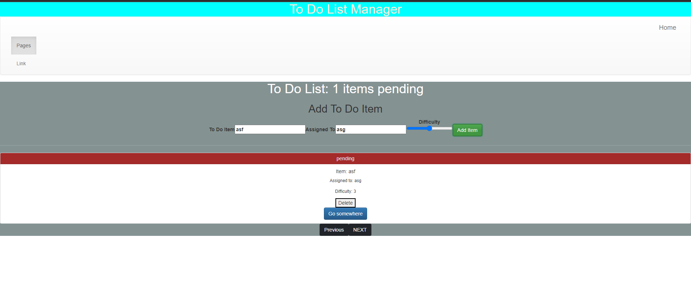
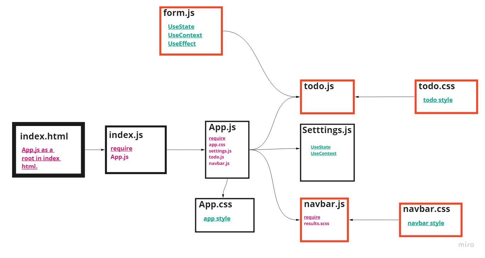

# **ToDo App**

---

# **Deploy**
[ToDo App - netlify](https://todo-app-v02.netlify.app/)

---

## **ToDo List**
The todo list app we’ll build in this tutorial will be pretty basic. A user can add a task, mark a task as completed and delete an already added task. 

## **BY**
- UseContext
- UseState
- UseEffect
- Test React
- Bootstrap

## **Summary of work:**
- ### **Add Todo List as a card**
   

## **UML Diagram**

